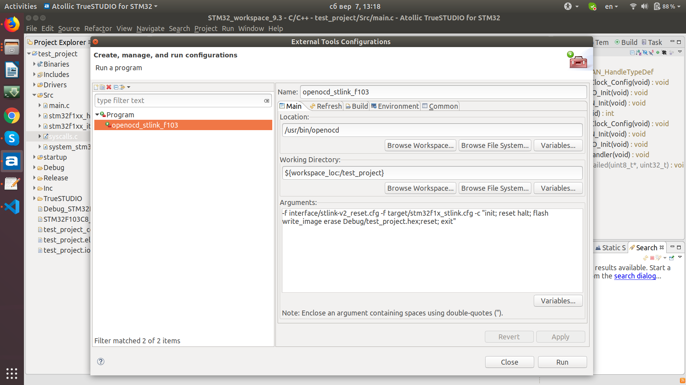

# openocd-config
###  openocd configurations for eclipse and other stuff

* testing connected stlink:
```sh
openocd -f interface/stlink-v2.cfg -f target/stm32f1x_stlink
```

* example for passing argumments without connecting to server
```sh
openocd -f ./ftdi.cfg -f target/stm32f4x.cfg -c "init; reset halt; flash write_image erase build/main.hex; reset; exit"
```

* 2nd one
```sh
openocd -f interface/stlink-v2.cfg -f board/stm32f4discovery.cfg -c "init" -c "reset init" -c "flash write_image erase myblink.hex" -c "reset" -c "shutdown"
```

* connect under reset configs for interface/stlink-v2_reset.cfg file:
```
#
# STMicroelectronics ST-LINK/V2 in-circuit debugger/programmer
#

interface hla
hla_layout stlink
hla_device_desc "ST-LINK/V2"
hla_vid_pid 0x0483 0x3748
## *** connect under reset ***
#reset_config srst_only srst_nogate
reset_config srst_only srst_nogate connect_assert_srst

# Optionally specify the serial number of ST-LINK/V2 usb device.  ST-LINK/V2
# devices seem to have serial numbers with unreadable characters.  ST-LINK/V2
# firmware version >= V2.J21.S4 recommended to avoid issues with adapter serial
# number reset issues.
# eg.
#hla_serial "\xaa\xbc\x6e\x06\x50\x75\xff\x55\x17\x42\x19\x3f"
```
* example configs for True Studio

